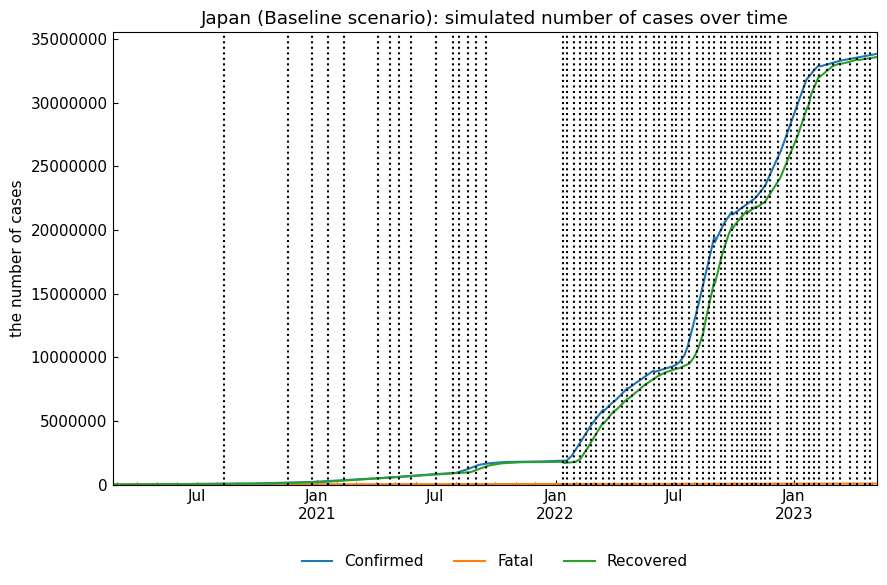

# SIR 模型：COVID-19 传播模拟

该项目实现了经典的 SIR (Susceptible-Infected-Recovered) 流行病数学模型，用于模拟 COVID-19 的传播和控制。项目使用多种数值方法求解 SIR 模型的微分方程组，并对比不同参数设置下的疫情发展趋势。

`SIR.py`以及`SIR.ipynb`来自于本人学习模拟测试所得\
`SIR_example.ipynb`来源于开源项目[covid19-sir](https://github.com/lisphilar/covid19-sir)

## 项目概述

SIR 模型将人群分为三个互斥群体：
- **易感人群 (S)**: 尚未感染的人群
- **感染人群 (I)**: 已感染且具有传染性的人群
- **康复人群 (R)**: 已康复或死亡，不再具有传染性的人群

模型通过以下常微分方程组描述疾病传播动态：  
$$\frac{dS}{dt} = -\beta S I$$  
$$\frac{dI}{dt} = \beta S I - \gamma I$$  
$$\frac{dR}{dt} = \gamma I$$


其中：
- N: 总人口数
- β: 传染率/接触率（有效接触率 = 传播概率 * 接触率）
- γ: 康复率（= 1/传染期）

| 参数 | 含义 |
| --- | --- |
| $S$ | (Susceptible) 易感者人数 |
| $I$ | (Infective) 感染者人数 |
| $R$ | (Removal) 恢复者人数 |
| $N$ | 总人口数 $N=S+I+R$ |
| $\beta$ | 传播率，每个感染者在单位时间内感染易感者的概率 |
| $\gamma$ | 康复率，每个感染者在单位时间内康复的概率 |
| $t$ | 时间 |
| $I_0$ | 初始感染者人数 |
| $R_0$ | 初始恢复者人数 |
| $S_0$ | 初始易感者人数 |

### 适用条件
1. **无重复感染**：恢复者获得永久免疫，如麻疹、水痘等。
2. **短时间内传播**：疫情的传播周期较短，不考虑出生、死亡或其他人口流动对人口总数的影响。
3. **均匀传播**：人群中的接触是随机且均匀分布的，没有显著的空间或社会网络结构影响。
4. **没有外部干预**：假设没有接种疫苗、治疗或隔离等干预措施。


## 数值解法

本项目实现了四种数值方法求解 SIR 模型：

1. **ODEINT**: 使用 SciPy 的 `odeint` 函数求解
2. **Euler 法**: 最简单的一阶显式数值方法
3. **改进的 Euler 法**: 二阶 Runge-Kutta 方法
4. **RK4 法**: 四阶 Runge-Kutta 方法


## 参数设置

基本参数设置：
- 总人口数 (N): 13,739,000 人（武汉市人口）
- 初始感染人数 ($I_0$): 170 人
- 初始康复人数 ($R_0$): 0 人
- 模拟时长: 160 天
- 基本传染率 ($β$): 1.1
- 基本康复率 ($γ$): 1/14 (约 0.071)

## 参数敏感性分析

项目探究了不同 β 和 γ 值对疫情传播的影响：
- β 值: 1.5, 1.1, 0.5
- γ 值: 1/14, 1/10, 1/7

| β   | γ    |
| --- | ---- |
| 1.5 | 1/14 |
| 1.1 | 1/14 |
| 0.5 | 1/14 |
| 0.5 | 1/10 |
| 0.5 | 1/7  |

`β`是传播率，可以描述隔离措施的强度，数值递减，模拟隔离措施逐渐加强  
`γ`是康复率，可以描述医疗治愈的水平，数值递增，模拟医疗水平逐渐提高


## 误差分析
在本项目中，我们对比了三种数值方法（Euler 法、改进的 Euler 法和 RK4 法）相对于ODEINT法求解 SIR 模型的误差，分别为绝对误差和相对误差：


从误差分析中可以看出，RK4 方法通常提供最高精度的结果，而 Euler 法的误差相对较大。改进的 Euler 法在精度和计算复杂度之间提供了一个折中方案。

## 文件说明

- `SIR.py`: Python 脚本实现 SIR 模型的求解与可视化
- `SIR.ipynb`: Jupyter Notebook，与 Python 脚本功能相同，方便交互式操作

## 实际数据测试

在本项目中，我们使用了 `SIR_example.ipynb` 来测试实际数据。数据集来源于[Kaggle](https://www.kaggle.com/datasets/lisphilar/covid19-dataset-in-japan)，计算方法参考开源项目 [covid19-sir](https://github.com/lisphilar/covid19-sir)，并进行了以下步骤：

1. **数据准备**: 使用 `covsirphy` 库自动构建日本的 SIR-F 模型。  
$$
\frac{dS}{dt} = -\beta S I
$$  
$$\frac{dI}{dt} = \beta S I - (\gamma + \alpha) I$$  
$$\frac{dR}{dt} = \gamma I$$  
$$\frac{dF}{dt} = \alpha I$$
2. **实际记录检查**: 模拟并检查实际记录。
3. **时间序列分割**: 显示时间序列分割结果。
4. **参数估计**: 使用 SIR-F 模型估计 ODE 参数值，并进行模拟。  
    这里我们使用了最小二乘法（Least Squares Method）进行参数估计。
5. **参数预测**: 预测未来 30 天的 ODE 参数值，并进行模拟。
6. **未来阶段添加**: 添加未来阶段，并显示创建的阶段和 ODE 参数值。
7. **参数比较**: 比较不同场景下的再生数（Rt）。
$$
R_t = \frac{\beta(t)}{\gamma(t)}
$$
8. **病例比较**: 比较模拟的确诊病例数。
9. **描述代表值**: 描述代表值。

通过这些步骤，我们能够验证模型在实际数据上的表现，并进行参数调整和预测。

```python
import covsirphy as cs

# 数据准备，时间序列分割，参数估计与 SIR-F 模型
snr = cs.ODEScenario.auto_build(geo="Japan", model=cs.SIRFModel)

# 检查实际记录
snr.simulate(name=None)

# 显示时间序列分割结果
snr.to_dynamics(name="Baseline").detect()

# 使用估计的 ODE 参数值进行模拟
snr.simulate(name="Baseline")

# 预测未来 30 天的 ODE 参数值
snr.build_with_template(name="Predicted", template="Baseline")
snr.predict(days=30, name="Predicted")

# 使用估计和预测的 ODE 参数值进行模拟
snr.simulate(name="Predicted")

# 添加未来阶段
snr.append()

# 显示创建的阶段和 ODE 参数值
snr.summary()

# 比较再生数（Rt）
snr.compare_param("Rt")

# 比较模拟的确诊病例数
snr.compare_cases("Confirmed")

# 描述代表值
snr.describe()
```

通过上述代码，我们可以对实际数据进行建模和分析，验证 SIR 模型的有效性。


根据实际数据，我们可以看到确诊病例数随时间的变化趋势。

根据 SIR-F 模型的模拟结果，我们可以看到模型对实际数据的拟合效果。

根据 SIR-F 模型的预测结果，我们可以看到未来 30 天的预测情况。

根据 SIR-F 模型的参数比较，我们可以看到模拟以及预测数据相对于实际数据的差异。

## 运行要求

- Python 3.6+
- NumPy
- SciPy
- Matplotlib

## 安装依赖

```bash
pip install numpy scipy matplotlib
```

## 使用方法

运行 Python 脚本：
```bash
python SIR.py
```

或者在 Jupyter Notebook 中打开 `SIR.ipynb` 文件。

## 结果分析

不同数值方法对比：
- 所有方法都能较好地近似 SIR 模型动态
- RK4 方法通常提供最高精度的结果
- 计算复杂度: RK4 > 改进 Euler > Euler

参数敏感性：
- 较高的 β 值导致更快的传播速度和更高峰值的感染人数
- 较高的 γ 值（更短的传染期）导致更快的疫情消退
- 当 β/γ < 1 时，疫情将不会导致大范围传播

$$
{\color{Blue}x^2}+{\color{Orange}2x}-{\color{LimeGreen}1}
$$